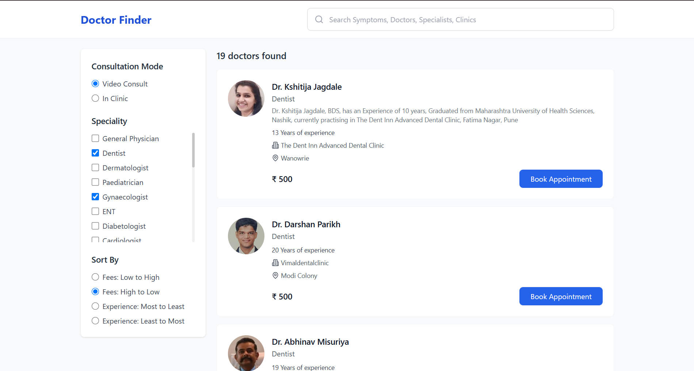
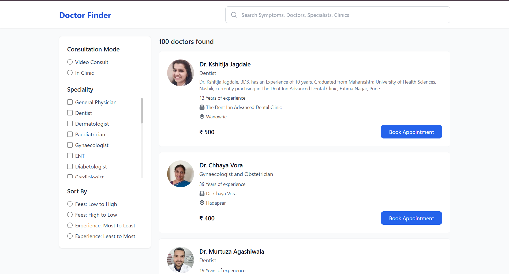
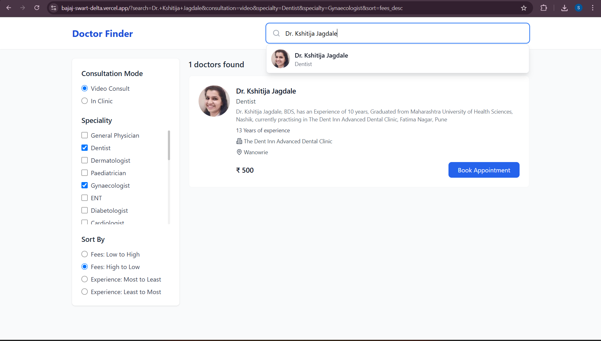

# Doctor Listing Application

A modern, interactive web application built with **React**, **Vite**, and **TypeScript**. This application provides a user-friendly interface for searching, filtering, and viewing detailed information about doctors. It leverages modern web development practices for a fast, responsive, and maintainable codebase.

## Features

- **Dynamic Doctor Listing:** Displays a comprehensive list of doctors fetched asynchronously. Each entry includes key information such as the doctor's name, specialty, location, contact information, and average patient rating.
- **Intuitive Autocomplete Search:** Features a powerful search bar with autocomplete suggestions, enabling users to quickly find doctors by name, specialty, or location as they type.
- **Advanced Multi-Criteria Filtering:** Offers a flexible filtering panel allowing users to refine the doctor list based on multiple criteria simultaneously, including:
  - Specialty (e.g., Cardiology, Dermatology)
  - Location (e.g., City, Zip Code)
  - Availability (e.g., Available Today, Next Week)
  - Insurance Accepted
  - Patient Rating
- **Detailed Doctor Profile Modal:** On clicking a doctor's card, a modal window appears, presenting in-depth information:
  - Full Name and Credentials
  - High-Resolution Photo
  - Detailed Biography and Professional Statement
  - Years of Experience
  - Educational Background and Certifications
  - List of Accepted Insurance Plans
  - Office Hours and Contact Details
  - Patient Reviews and Ratings
  - Map Integration for Location (Optional)
- **Responsive and Accessible Design:** Developed using **Tailwind CSS** for a fully responsive layout that adapts seamlessly to various screen sizes (desktops, tablets, mobiles). Adheres to accessibility best practices (WCAG).
- **Asynchronous Data Handling:** Efficiently fetches and manages doctor data from a mock API endpoint (`src/api/doctorsApi.ts`). Easily configurable to connect to a real backend API.
- **State Management:** Utilizes React hooks (`useState`, `useEffect`, `useMemo`) for effective state management within components.
- **Type Safety:** Built with **TypeScript** to ensure type safety, improve code quality, and enhance developer experience through static analysis and better autocompletion.

## Screenshots

_(Add screenshots of the application UI here. You can embed images using Markdown syntax:)_

```markdown



```

## Tech Stack

- **Frontend Library:** [React](https://reactjs.org/) (v18+) - For building the user interface with components.
- **Language:** [TypeScript](https://www.typescriptlang.org/) - Adds static typing to JavaScript for enhanced code reliability.
- **Build Tool:** [Vite](https://vitejs.dev/) - Provides a fast development server and optimized production builds.
- **Styling:** [Tailwind CSS](https://tailwindcss.com/) - A utility-first CSS framework for rapid UI development.
- **Linting:** [ESLint](https://eslint.org/) - For identifying and fixing code style issues and potential errors.
- **Package Manager:** npm / yarn / pnpm
- **Icons:** [Lucide React](https://lucide.dev/) - A collection of simply beautiful open-source icons.

## Project Structure

```
/
├── public/             # Static assets (e.g., favicon.ico) accessible directly
├── src/                # Main source code directory
│   ├── api/            # Contains API fetching logic (e.g., doctorsApi.ts)
│   ├── assets/         # Static assets used within components (images, fonts)
│   ├── components/     # Reusable React UI components
│   │   ├── AutocompleteSearch.tsx # Search input with suggestions
│   │   ├── DoctorCard.tsx       # Displays summary info for one doctor
│   │   ├── DoctorList.tsx       # Renders the list of DoctorCards
│   │   ├── DoctorModal.tsx      # Modal for detailed doctor view
│   │   └── FilterPanel.tsx      # Component for filtering options
│   ├── hooks/          # Custom React hooks (if any)
│   ├── types/          # TypeScript type definitions (e.g., Doctor type in types.ts)
│   ├── utils/          # Utility functions (e.g., filterUtils.ts)
│   ├── App.tsx         # Root application component, orchestrates layout and routing (if added)
│   ├── main.tsx        # Application entry point, renders App component
│   └── index.css       # Global styles, Tailwind directives, and base styling
├── .eslintrc.cjs       # Configuration for ESLint
├── .gitignore          # Specifies intentionally untracked files that Git should ignore
├── index.html          # Main HTML file, entry point for Vite
├── package.json        # Lists project dependencies and scripts
├── postcss.config.js   # Configuration for PostCSS (used by Tailwind)
├── README.md           # This file: Project documentation
├── tailwind.config.js  # Configuration for Tailwind CSS (themes, plugins)
├── tsconfig.json       # TypeScript compiler options for the project
├── tsconfig.node.json  # TypeScript compiler options for Node.js environment (e.g., Vite config)
└── vite.config.ts      # Configuration for Vite build tool
```

## Getting Started

### Prerequisites

- **Node.js:** Version 18.x or later recommended. Download from [nodejs.org](https://nodejs.org/).
- **Package Manager:** npm (comes with Node.js), [yarn](https://yarnpkg.com/), or [pnpm](https://pnpm.io/).

### Installation

1.  **Clone the repository:**
    ```bash
    git clone <repository-url> # Replace <repository-url> with the actual URL
    cd <repository-directory>  # Navigate into the project folder
    ```
2.  **Install dependencies:** Choose one of the following commands based on your preferred package manager:

    ```bash
    # Using npm
    npm install

    # Using yarn
    yarn install

    # Using pnpm
    pnpm install
    ```

### Running the Development Server

To start the application locally with hot module replacement (HMR) for a fast development experience:

```bash
npm run dev
# or
yarn dev
# or
pnpm dev
```

This command will typically start the server on `http://localhost:5173`. Open this URL in your web browser to view the application. The server will automatically reload when you make changes to the code.

### Building for Production

To create an optimized build suitable for deployment:

```bash
npm run build
# or
yarn build
# or
pnpm build
```

This command generates a `dist` directory containing the optimized static assets (HTML, CSS, JavaScript).

### Previewing the Production Build

After building, you can preview the production version locally:

```bash
npm run preview
# or
yarn preview
# or
pnpm preview
```

This will serve the contents of the `dist` directory, allowing you to test the production build before deployment.

### Linting

To analyze the code for potential errors and style inconsistencies using ESLint:

```bash
npm run lint
# or
yarn lint
# or
pnpm lint
```

This helps maintain code quality and consistency across the project.

## Contributing

Contributions are welcome! Please follow these steps:

1.  Fork the repository.
2.  Create a new branch (`git checkout -b feature/your-feature-name`).
3.  Make your changes.
4.  Commit your changes (`git commit -m 'Add some feature'`).
5.  Push to the branch (`git push origin feature/your-feature-name`).
6.  Open a Pull Request.

Please ensure your code adheres to the project's linting rules.

## License

This project is licensed under the MIT License - see the LICENSE file (if one exists) for details. (Consider adding a LICENSE file if distributing).
